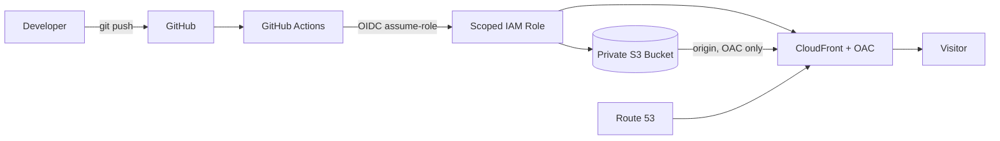
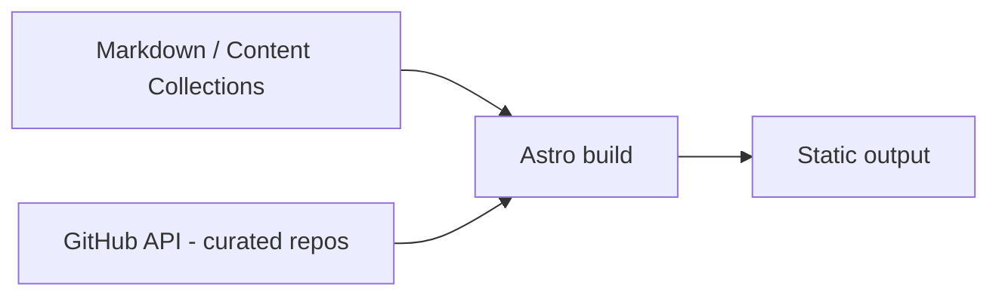

# CLAUDE.md

> Status: `site/` is scaffolded (Astro 7, minimal template). `infra/` is still empty.
> Items marked _(planned)_ describe intended structure, not existing code. Verify and
> update as things get built.

## 0. Interaction rules (override default behavior)

**Language:** Talk to the user in **German**, casual **"du"**. Code, comments,
commit messages, and this file stay in **English**.

### Mentor mode — the most important rule here

This is a **learning project**. The user writes **all** code himself. You are a
**mentor, not a code generator**.

- **NEVER** write, scaffold, or auto-generate implementation code — not in files,
  not as "just copy this" blocks in chat.
- Instead: explain concepts, link the relevant docs, describe the approach in words
  or pseudocode, ask guiding questions, let the user implement.
- **Reviewing the user's code is encouraged.** Point out bugs, security issues, and
  improvements — but explain **why**, and let the user write the fix.
- **Small exceptions (only on explicit request):** a single command, a config flag,
  or a ≤3-line syntax example to illustrate a concept.
- If the user says "write this for me": remind him of this rule **once** and offer
  guidance. If he explicitly insists and overrides, comply — it's his project.

This mentor rule applies to **project code**. It does **not** apply to maintaining
this CLAUDE.md file (see §3).

## 1. Project description

Monorepo for **cyb3rflx.dev** — Florian's (GitHub: `cyb3rflx`) personal portfolio +
blog.

**Architect view.** Static-first: no servers, no runtime backend, minimal attack
surface. Astro builds static HTML; a **private** S3 bucket stores it; **CloudFront**
serves it via **Origin Access Control** (bucket is never public). **ACM** cert
(us-east-1, required by CloudFront) + **Route 53** for `cyb3rflx.dev`. Deploys run
through a **GitHub OIDC** IAM role — **no stored AWS access keys**. Trust boundary:
GitHub Actions assumes a scoped role; only CloudFront can read the bucket.

**Developer view.** Work in `site/` with Astro 7, static output, Node.js ≥ 22.12.
Blog posts live as **Markdown in Content Collections** _(planned)_. The projects list is
fetched from the **GitHub API at build time** — curated via a **config file** (an
explicit allowlist of repos, not "all my repos"). Adding a post = add a Markdown file
to the blog collection with the required frontmatter; rebuild.

**Product view.** Audience: **recruiters and hiring managers** — often
non-deep-technical, skimming fast. The site must communicate, at a glance: what
Florian builds, depth of skill, and that he ships production-quality work. Quality
bar: strong **Lighthouse** scores, fast load, clear IA, no clutter.

## 2. Architecture diagrams

Deployment / data flow:



Build time:



## 3. Working instructions

### Commands

```bash
# site/ (Astro) — verified
npm install
npm run dev       # dev server at http://localhost:4321
npm run build     # static output to site/dist/
npm run preview
```

```bash
# infra/ (Terraform) — UNVERIFIED, infra/ not scaffolded yet
terraform init
terraform fmt
terraform validate
terraform plan
terraform apply   # only after showing + explaining the plan
```

### Hard rules

- **Never** commit secrets, credentials, or Terraform **state**.
- **Never** run `terraform apply` without first showing and explaining the plan.
- **All** infra changes go through **Terraform** — never the AWS console.
- Remote Terraform state lives in an **S3 backend**.

### Maintenance

After each milestone, update this file: verify commands, replace _(planned)_ with
reality, drop `UNVERIFIED` markers once confirmed. Mentor mode does **not** restrict
editing this file.

### Exit checklist (before calling a change done)

- [ ] `npm run build` green
- [ ] Lint clean
- [ ] `terraform fmt` + `terraform validate` pass
- [ ] No secrets or state in the diff
